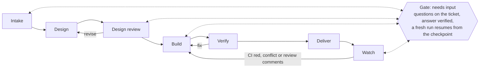
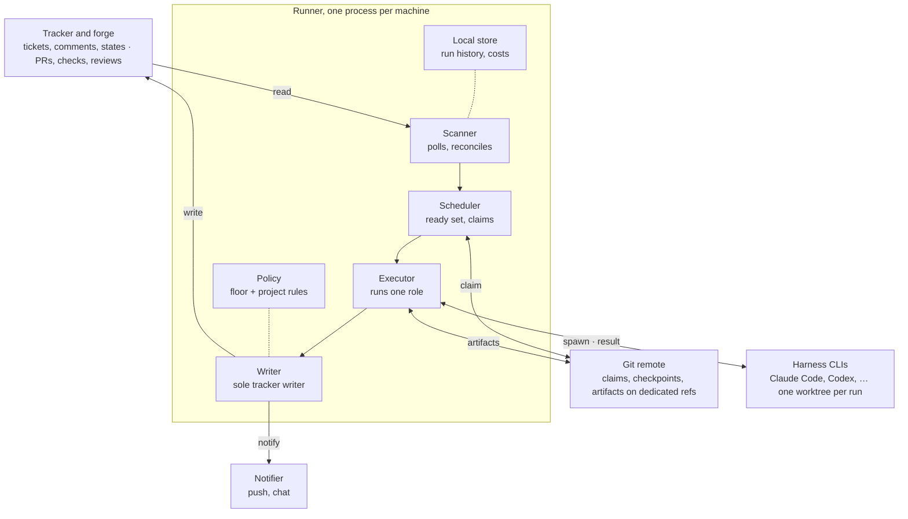

# Owlshift — design & architecture

Status: draft, 2026-09-27. Companion documents: [scenarios](scenarios.md), [runtime & operations](runtime-and-operations.md), [roadmap](roadmap.md), [build plan](build-plan.md).

Owlshift is an open-source runner that works a team's existing backlog continuously with coding agents, and brings a human in only where a decision is theirs, on the ticket, in the tracker they already use.

## 1. Purpose & positioning

The bottleneck of agentic development is no longer writing code, it is human attention: questions buried in terminals, work that waits because nobody noticed a blocker cleared, parallel agents colliding on the same files, sessions a person has to babysit.

**What it is.** A runner that:

1. pulls ready tickets in priority order, respecting dependencies and conflicts with all work in flight, human work included;
2. takes each ticket through a multi-stage pipeline (intake, design, review, build, verify, deliver, watch), each stage on the harness and model that fits it;
3. stops and asks on the ticket whenever a decision belongs to a human, checks that the answer actually answers, and resumes, as many rounds as needed;
4. delivers a verified pull request. Humans merge.

**What it is not.** Not an IDE, a chat or a new board: the team's tracker stays the interface. Not an auto-merger. Not a hosted service: it runs on a developer's machine or a team's server.

**Landscape, as of 2026-09-27.** Ticket-to-agent orchestration became a category in 2026. The two closest projects:

| Project | Shape | Human decisions mid-run | Blockers and conflicts | License |
| --- | --- | --- | --- | --- |
| [Symphony](https://github.com/openai/symphony) (OpenAI) | A [spec](https://raw.githubusercontent.com/openai/symphony/main/SPEC.md) plus an Elixir reference implementation, engineering preview; drives the Codex app-server; in-memory state | A run "MUST NOT stall" on user input: each implementation auto-fails, surfaces to an operator or auto-approves; the run ends in a handoff state such as Human Review | `blocked_by` is passed to the prompt, not enforced by the scheduler; no conflict avoidance | Apache-2.0 |
| [Sortie](https://github.com/sortie-ai/sortie) | Go single binary with SQLite; GitHub, GitLab, Gitea, Linear, Jira; Claude Code, Codex, Copilot, OpenCode, Kiro, Gemini; a `WORKFLOW.md` per project ([docs](https://docs.sortie-ai.com/)) | A handoff state at the end of the run; no documented question loop during it | Not documented beyond isolated workspaces | Apache-2.0 |

Parallel-agent workspaces such as [Vibe Kanban](https://vibekanban.com/) manage agents from their own board, supervised by a person: a different lane.

**Where this product differs: three bets.**

1. **The human decision loop is the product.** Questions are posted on the ticket at any stage (before code, during it, after the PR), answers are verified before anything resumes, and there is no limit on rounds.
2. **Scheduling is enforced, not advisory.** Blockers gate dispatch. Declared resources (code zones, migration chains, the one browser) keep two in-flight tickets from colliding, whether an agent or a person holds them.
3. **A ticket is a pipeline, not a session.** Plan before code, independent review by another model family, each stage routed to the harness and model that fits it, cost measured per ticket.

Owlshift is built from scratch rather than on top of Sortie (decision D1, section 12).

## 2. Design principles

Nine rules; every later choice in this document derives from one of them.

1. **The tracker is the human interface, git is the machine's memory.** No new board to adopt. Everything a person needs to see or answer lives on the ticket; everything the runner needs to resume lives in the repository.
2. **No LLM sits idle, and none orchestrates.** Scheduling, state and policy are deterministic code. A model is called only to run a role, for as long as that role takes. At rest the runner costs zero tokens.
3. **An agent that needs a human stops.** It leaves a checkpoint and a question, and a fresh run resumes from both once answered. Answers arrive hours later; keeping a context alive for them buys nothing.
4. **Ask as early as possible.** The dominant latency is the human's, so questions surface at intake, before a ticket can block anything.
5. **Silence is never consent; in doubt, ask again.** An unanswered or ambiguous reply never starts work.
6. **Nothing enters the work queue without a human gesture.** The runner only pulls tickets a person admitted; follow-ups it proposes wait in an inbox.
7. **Guardrails are enforced by the runner, not requested of the model.** Agents have no tracker write access and cannot merge, deploy or change state, by construction.
8. **Neutral by contract.** Tracker, forge, harness, model and stack are adapters behind capability contracts. A contract is frozen only after three implementations exist, one of them possibly on paper.
9. **Subscription first.** Owlshift drives the Claude and Codex CLIs on the user's own subscription: Codex through the login the user configured, Claude Code agent runs through a token of that subscription made with `claude setup-token` and stored by `owlshift init`, never the user's own Claude Code login. It never asks for, stores or passes a model API key, and the user's own Claude Code configuration does not reach an agent run: a Claude Code agent run is billed to the subscription through that token, and a Codex run on an API-key login is the one API-billed case expected ([runtime and operations](runtime-and-operations.md)).

## 3. Core model

Ten concepts, owned by the product and independent of any tracker, harness or stack.

| Concept | Definition | Lives in |
| --- | --- | --- |
| Ticket | A unit of work read from the tracker, admitted to the queue by a human gesture | Tracker |
| Pipeline | A declarative sequence of stages a ticket goes through; a project ships variants (`trivial`, `standard`, `risky`) | Project config |
| Stage | One step of a pipeline: a role to run, its entry condition, its exit contract, its gates | Project config |
| Role | What a stage executes: a prompt, required capabilities (browser, network), a permission level (read-only, write in worktree) | Product, overridable per project |
| Run | One execution of a role on one harness, in one worktree; returns a validated `result.json` and a measured cost | Runner, logged to git |
| Gate | A point where a human decision may be needed: clarification, arbitration or approval | Ticket (questions and answers) |
| Artifact | What a stage leaves for the next: plan, step ledger, review findings, delivery report | Git (dedicated refs) |
| Resource | Something two in-flight tickets cannot hold at once: a code zone, a migration chain, the browser, a port range | Declared at intake, held by claims |
| Policy | A non-configurable floor plus per-project rules: what may be decided without a human, budgets, caps | Product floor + project config |
| Adapter | The boundary to an outside system, declaring its capabilities: tracker, forge, harness, notifier, stack profile | Product (built-in) or plugin |

A project adopts the product with one committed file (the project config) plus one uncommitted file per developer (identity, installed harnesses, local caps).

## 4. Default pipeline & gates

A ticket moves through seven stages; three loop back, and four can stop at a gate where a human decides.

Dashed links mark the stages that stop for a human in the default pipeline: Intake (clarification), Design review (plan approval), Build (plan invalidated) and Watch (a prerequisite or a finding to arbitrate). A human merges after Watch.

| Stage | Does | Leaves behind |
| --- | --- | --- |
| Intake | Understands the ticket, checks its external premises live, declares resources, picks the variant and the routing | Routing record, resources, questions |
| Design | Writes the plan: approach, files, test strategy, risks, success criteria | Plan |
| Design review | Independent reviewers, from another model family when available; their number follows the risk | Findings, approval |
| Build | Implements step by step, one commit and one ledger entry per step; runs the project's full gate (lint, formatter, tests) | Commits, ledger |
| Verify | Checks the diff against the plan and criteria, cross-family review, browser QA when declared, reads the complete CI result | Verdict; a bounded fix loop |
| Deliver | The runner opens the PR and posts the delivery report on the ticket | PR, report |
| Watch | Reacts to CI regressions, merge conflicts and human review comments on the PR | Fix runs, rebases, gates |

**Variants.** `trivial` skips Design and Design review and uses one reviewer. `standard` is the diagram. `risky` adds reviewers and makes human plan approval mandatory. Intake picks the variant; a label on the ticket forces one.

**Gate policy.**

- **Resolver first.** Every question a role raises goes through a resolver run. What is discoverable (the ticket, the repository, the docs, a verifiable fact) is decided and logged on the ticket as a reversible decision; the rest goes to a human. Decided on 2026-10-03 (OWL-138): the runner routes each question by its category, so an always-human one never reaches the resolver; the resolver is a read-only run without network at the standard tier (section 9), so a verifiable fact is one it can check offline; each decision is a DECISION comment, kept in the ticket ref, from which alone a later run reads it, and the decider's word overrides it. When every question of a run is decided, the stage runs again without a stop, at most three runs in a row in one command before the questions go to the decider. Until a fallback harness exists (P6), a resolver that cannot give its result sends every question to the decider ([build plan](build-plan.md), "The resolver"). Decided on 2026-10-04 (OWL-144): a question the asking run files under the wrong category still reaches the resolver, so the resolver labels each question it decides with a category of its own, read from the question's text and context without seeing the asking run's, and the runner logs the decision only when neither label is always-human and the resolver's is a well-formed token; otherwise the question goes to the decider. The runner draws that consequence; recognising the topic stays a model's judgment, and what remains is plain: a floor-topic question both runs label as something else is still decided, reversible like any decision and listed in the delivery report; a project's own always-human categories are told to both runs since OWL-151 (decided 2026-10-04), in the brief's `always_human`, so each labels with them, but recognising a topic stays a model's judgment and a question on one both runs label otherwise is still decided; decisions kept before this check stay as they were.
- **Always human.** Security, data loss, money, legal wording, irreversible external actions and scope changes. This is part of the floor: projects may add categories, never remove one.
- **Plan approval** is set per project: `always`, `on-fork` (only when the design has a real fork) or `never`; the `risky` variant forces `always`.
- **Who decides.** One person, the ticket's decider: only their answers unblock the ticket; other people's comments are context. Decided on 2026-10-02 (OWL-33), reading "the assignee by default" literally: the decider is the ticket's assignee whenever it has one. A ticket without an assignee falls back on the owners the project names for its code zones (`[zones]` in the project file, [runtime & operations](runtime-and-operations.md#configuration)). Each zone the ticket declared belongs to the owner of the deepest owned zone that contains it; a declared zone no owned zone contains has no owner, even when owned zones lie inside it, so a ticket declaring `backend` while `backend/billing` has an owner touches no owned zone, and declaring the narrower zones is the fix. Zones without an owner are left out: when the owned zones the ticket touches all belong to one person, that person decides; when they belong to several, or the ticket touches no owned zone, the ticket has no decider, and the runner says why instead of picking one. The decider is resolved when a question is asked, from the assignee and the zones declared then, and stays the decider of that ask; owners are read from the project file at the base commit, never from a run's worktree, so a run cannot choose who instructs it. Rejected: the zone owner before the assignee, which would change a ticket's decider once intake declares its zones and keep the person who delegated it from unblocking it; and several deciders on one ticket, which would leave the answer check without a single last word.
- **Answer check.** Questions are numbered. Before any resume, a small run classifies each one: answered, partial, unanswered, or a counter-question. The runner then resumes, re-asks only what is missing, or replies in the thread. Each check has exactly one of these outcomes, by precedence (decided on 2026-10-01, OWL-114): a counter-question on any question gets the reply and nothing else, so nothing is re-asked and the round does not count toward the re-ask limit, and the next check, after the decider's next reply, classifies every question of the same ask again; otherwise any partial or unanswered question is re-asked, or the ticket parks once the re-ask limit is reached; only when every question is answered does the ticket resume. The answer check writes the reply (decided on 2026-10-02, OWL-115): the run that recognises the counter-question already holds what answers it, the question's context, options and recommendation, the decider's comments and the ticket, so each `counter_question` verdict carries its own reply, and the runner posts it as written, flattened to one line like every text a model writes. Rejected: the resolver, which would add a run per counter-question and a repository-wide context to explain a question already asked, and whose job is to decide, not to talk with the decider; and a reply the runner composes itself, which cannot say what an option means. The reply rests on the brief alone, so it cannot carry repository content the brief does not; when the brief does not hold the answer, the reply says so.
- **No premature resume.** The runner waits for a quiet window after the decider's last edit (10 minutes by default, `policy.quiet_window_minutes` in `owlshift.toml` sets it per project, from 1 to 1440) unless the reply ends with `go`, and re-reads the thread before delivery for late comments. Decided on 2026-10-03 (OWL-127): the window holds whoever notices the answer, a person typing `owlshift continue TICKET` as much as `watch`, since the person typing it is often not the decider and an answer checked before it is finished can spend a re-ask. The reply is the decider's comment with the newest last edit, and it ends with `go` when its last word is `go` in any case, punctuation trimmed. Rejected: a typed command skipping the window, and a flag to override it, which would let the operator overrule a decider still writing. Decided on 2026-10-04 (OWL-139): for a ticket whose ticket ref keeps an ask, the runner re-reads the comments once a Build run is done and its gate passed, before the push; a late comment is the decider's (the decider of the latest ask) whose last edit is newer than the newest one that run's brief held, so a comment posted between the answer check and the Build start is not late, since the Build read it as an instruction. A late comment gets one more Build run, its thread holding the comment, and that run judges it against the work in front of it: `done` integrates it and delivers, recorded as a decision in the delivery report; questions send the ticket back to needs-input, straight to the decider without the resolver, in a round that names the late comments. A comment the run can follow is integrated, even one that reverses an earlier answer, since the decider's latest word is the instruction; "contradicts the work" means the run cannot integrate it without the decider. One such run per delivery: a further late comment after it opens a round of one always-human question naming them, and nothing is pushed. Rejected: the answer check, whose classes say whether a question of the latest ask is settled and which reads the brief alone, never the work; and a dedicated classification role, which needs a role, a result shape and a contract format of its own, judges the work without it, and still needs the Build run to integrate. Known gap: the build role is not told which comments are late, so a resumed run whose steps are all done may deliver without the change; the decision in the delivery report shows it to the reviewer. A ticket without a question round is delivered without a re-read.
- **Pull request reviews are an input channel.** A human review comment sends the ticket back to Build or opens a gate, like a ticket comment.
- **A parked ticket shows it.** Decided on 2026-10-04 (OWL-148): when the runner parks a ticket, the PARKED comment is followed by a move of its visible stage to the state the project maps under `[tracker].states.parked`, an optional key; a project that names none shows a parked ticket as needs input, and the PARKED comment says why. So the stage alone does not say that questions are open: the comments and the ticket ref do, and nothing reads the stage back. A restart moves the stage to what the ticket then waits for: needs input when it was parked while questions waited, working when Build runs again. Rejected: a required key, which would break every existing project file and ask every tracker for a workflow state of its own; and needs input alone, which leaves a parked ticket indistinguishable from one waiting for an answer.

## 5. Architecture overview

One deterministic runner per machine serves every adopted project; models only ever run inside a harness, one role at a time. Agents never touch the tracker: the runner is its only writer.

One event, end to end:

1. **Scanner** polls the tracker and the forge (webhooks are an optional speed-up, never required) and turns changes into events: ticket admitted, answer posted, PR merged, check failed.
2. **Scheduler** computes the ready set (admission, blockers, resources, caps, budget) and claims a ticket with an atomic push of a git ref, so two machines never take the same ticket.
3. **Executor** creates the worktree, writes the brief, launches the harness CLI for one role, then validates `result.json` against its schema and checks isolation (main checkout untouched, diff inside the worktree, right branch). An exit code is never taken as proof.
4. **Writer** applies the result: comments, state transitions, follow-up proposals, the PR. It is the only component with write access to the tracker and forge, and it asks **Policy** before each write.
5. Artifacts and the checkpoint go to the git remote; cost and run history go to the **Local store** (SQLite); the **Notifier** fires only when a human has become the blocker.

**Deployment.** One runner process per machine serves several projects, with machine-wide caps (concurrent runs, the single browser slot, port ranges). A local API serves the CLI, the local web UI (P8) and the desktop app (P11). The same binary runs on a team server; since shared state lives in the tracker and git, moving from a laptop to a server needs no migration.

## 6. Adapters & contracts

Five adapter kinds, each declaring its capabilities; `init` refuses a project whose adapters miss a required capability and applies a documented fallback for each optional one.

| Kind | What the core needs | First (P1 to P5) | Kept in mind |
| --- | --- | --- | --- |
| Tracker | Tickets, comments, visible stage (table below) | Linear; a test tracker in the repo | GitHub Issues and the public Markdown tracker in P9; GitLab, Jira, Plane |
| Forge | Open a PR, read the complete check set and review comments, push branches and custom refs, read merge state | GitHub | GitLab, Gitea, Bitbucket |
| Harness | Run one role headless in a directory through the vendor's own CLI and the login that CLI's agent runs use (Codex's own, the stored `claude setup-token` token for Claude Code), with a model, an effort and a permission level; honour the result-file contract; report usage and usage limits | Claude Code, Codex | OpenCode, Gemini CLI; a third one on paper before the contract freezes |
| Notifier | Send one short line to one person | Tracker mention; a generic webhook | Chat apps, e-mail, push services |
| Stack profile | Declarative: install, full gate (lint, formatter, tests), dev servers and ports, resource patterns such as migration paths, path-scoped rules to inject | Hand-written for the first adopter | Detection presets per ecosystem in `init` |

The Markdown tracker is not a toy: it is the core's test double, the zero-account demo, and the mode for projects without a tracker.

**Tracker capabilities.**

| Capability | Required | Fallback when missing |
| --- | --- | --- |
| Read a ticket: title, description, priority, assignee, labels, author | yes | none |
| List admitted tickets | yes | none |
| Read and write comments with author and last-edit time | yes | none |
| Show the visible stage (ready, in progress, needs input, in review) | yes | `agent:*` labels when states are fixed (GitHub Issues is open/closed only) |
| Blocked-by relations | no | a parsed text convention (`Blocked by #123`) |
| A proposals inbox for follow-ups | no | an `agent:proposed` label and a saved view |
| A distinct agent identity | no | an `[agent]` marker on comments and an external notifier |
| Webhooks | no | polling, always supported |

Jira is the known hard case: its workflows forbid some transitions, so its adapter must find a path between two states or fail at `init`, never at run time.

**Harness contract.** A harness is always the vendor's own CLI, run on the user's own subscription: Owlshift never calls a model API itself. A confined Claude Code run logs in with a token of that subscription the operator made with `claude setup-token` (OWL-94). A run gets a brief file in and must leave a `result.json` out (status, numbered questions, decisions taken, follow-ups, PR data). Permission levels map onto each harness's own mechanism: permission modes and tool lists for Claude Code, sandbox modes for Codex. A harness adapter builds the command and reads the run's output; the executor spawns the command in a process group of its own, so stopping a run, timeouts and the run log stay with the executor whatever the harness ([build plan](build-plan.md#cli-surface-for-p0-and-p1), OWL-14). The runner injects project conventions itself, including path-scoped rules for the ticket's declared zones, so a harness's own instruction-loading mechanism never decides what an agent knows. Since P1 it injects the files the project names in `stack.rules`, by default the root `AGENTS.md`, as they stand at the base commit, each a rule for the whole repository; path-scoped rules arrive with the zones intake declares ([build plan](build-plan.md#cli-surface-for-p0-and-p1), OWL-61, OWL-67). Checked on 2026-09-27 on local installs: `claude -p` accepts `--model`, `--effort`, `--json-schema`, `--max-budget-usd` and `--permission-mode`; `codex exec` accepts `-m`, `-s` (sandbox) and `-C`, while `codex review` rejects `-m`.

**Extensibility.** Built-in adapters come first. Once the contracts are stable, an out-of-process adapter protocol (JSON over stdio, in the spirit of LSP and MCP) lets anyone write an adapter in any language.

## 7. State, coordination & multiple developers

Shared state lives where every participant already has access, the tracker and the git remote, so several developers and machines coordinate without any server.

| State | Where | Why there |
| --- | --- | --- |
| Visible stage, questions, answers, decisions, delivery reports | Tracker | People read and answer there |
| Claim on a ticket, with a lease | A git ref per ticket under a product namespace | An atomic update on the remote: exactly one runner wins |
| Pipeline position, round counters, checkpoint, plan, ledger, review findings | Git refs per ticket | Any runner on any machine can resume |
| Code | The ticket's branch | As usual |
| Run history, measured cost | Local SQLite; a cost summary copied to the ticket | Per-operator accounting |

**Claims.** A runner claims a ticket by creating its claim ref with "absent" as the expected old value; the git server applies ref updates as compare-and-swap, so a second runner's push is rejected. The holder renews a lease at every run; a lease older than a configured limit can be taken over, which recovers the tickets of a laptop that went to sleep. Whether each forge accepts pushes to a custom ref namespace is checked per forge adapter.

**Privacy.** A public repository paired with a private tracker would publish plans and questions through git refs. The artifact store is therefore configurable: git refs (default), a local directory (solo use), or tracker attachments.

**People.** Four roles, which one person holds alone in solo use:

- **Decider**: answers the gates of a ticket; its assignee, or for a ticket without one, the single owner of the code zones it touches (section 4).
- **Delegator**: admits a ticket for an agent to work.
- **Reviewer**: reviews and merges the PR.
- **Operator**: runs a runner; its runs consume the operator's own subscriptions.

**Which runner takes which ticket.** A developer's runner takes only the tickets its operator delegated, so one person's machine never spends another person's budget. A team server takes every admitted ticket.

**In flight** means everything claimed by any runner, every ticket a human has in progress, and every open PR; resources are computed across all of them, so an agent never starts on a zone a colleague is editing by hand.

**Identities.** A person maps to a tracker account and a forge account in the project config, so a PR review comment and a ticket comment count as the same decider. The runner posts under a distinct agent identity wherever the tracker offers one: Linear app users can be delegated issues while the human assignee stays the owner, and are not billed as seats ([Linear docs](https://linear.app/docs/agents-in-linear)); on GitHub, a GitHub App. Elsewhere, the `[agent]` marker applies.

## 8. Policy, security & trust

The floor is code a project cannot configure away: no agent merges, deploys, changes infrastructure or holds tracker credentials, and nothing written by an unauthorised person is ever treated as an instruction.

**The floor.**

- Owlshift never merges: neither an agent nor the Writer, approval or not; a human merges. No deploy or infrastructure change (environment variables, feature flags, DNS, CI settings) without an explicit human approval recorded on the ticket.
- Owlshift never handles model API keys: Codex authentication stays in Codex's own configuration. The one model login it holds is the token confined Claude Code runs log in with, made by the operator with `claude setup-token`, kept in the system keychain, read by the runner and handed to the harness command alone, on a pipe it inherits (OWL-96): never in any environment, the agent's included, a gate command, a probe, a file Owlshift writes, an event or a message, and replaced by `<redacted>` in the run's logs (OWL-94).
- Agents hold no tracker, forge or cloud credentials; the Writer is their only holder. An agent starts from an empty environment: what a program needs to run, where a harness other than Claude Code finds its login, the operator's proxy unless it holds a login, which refuses the run (OWL-76), and the variables the project declares for its own gate (`stack.gate_env`) that the operator allows in the personal configuration (`allow_gate_env`): a project's declaration never widens that list, and a known credential, a variable of Claude Code's own (`ANTHROPIC_*`, `CLAUDE_*`) or of Codex's (`CODEX_*`, `OPENAI_*`), which chooses where a run sends its requests and with which login, or one that makes a program load code as it starts (`LD_*`, `DYLD_*`, `BASH_ENV`, `NODE_OPTIONS`), is refused even when listed (OWL-63, OWL-120, OWL-125). Git and gh are left without a credential, a harness loads no settings file, the user's or the repository's, and no MCP server, and the Executor checks this before each run ([build plan](build-plan.md#results), OWL-22); a Claude Code run that reports an API key or an MCP server fails.
- A process that goes looking is stopped by the operating system (OWL-41): the Executor runs every agent, the harness and everything it starts, and every gate command inside a sandbox it builds itself, `sandbox-exec` on macOS and `bwrap` on Linux. The home is unreadable but for the folders a run needs, among them the tool chains its declared variables name, read-only and never a folder that is, lies in or holds a credential path (OWL-68); nothing is written outside the worktree, the repository's git folder (not its hooks or configuration) and the run's own temporary folder, the temporary folders the user's other processes share are closed, and the system credential store (the Keychain, the Secret Service) is closed. Claude Code therefore runs on the token above, in an empty configuration folder inside the run's temporary folder, gone with the run (OWL-94), and keeps its temporary files in a folder of that one too, clear of the user's own `/tmp/claude-<uid>` (OWL-100). A machine that cannot confine an agent runs none: native Windows is refused and pointed to WSL2 (decision D9), and a Linux machine without a usable `bwrap` is refused, with `owlshift doctor` saying how to fix it. Known limits, recorded with their live checks in the [build plan](build-plan.md#results): the network stays open, so an agent can reach anything it may read, the agent login included, which its shell commands inherit and the operator can revoke; secrets outside the home on shared mounts are not hidden; on macOS a process that leaves the run's process group with `setsid` is not stopped with it, and `sandbox-exec` is deprecated and does not nest.
- The always-human gate categories (security, data loss, money, legal wording, irreversible external actions, scope changes) can be extended, never removed. A question names its category with a token: `security`, `data_loss`, `money`, `legal`, `irreversible` or `scope`. A category that contains a token as whole words, such as `scope_change` or `risk of data loss`, counts as that token, and a question with no category goes to a human. The resolver's own label on a question it decides is held to the same categories and must be a token: an always-human or malformed label sends the question to a human (OWL-144).
- After every run the Executor checks isolation: main checkout untouched, diff inside the worktree, expected branch. A violation quarantines the run and parks the ticket.
- A run without a valid `result.json` is a failure, whatever its exit code.

**Untrusted input.** On a public repository anyone can open an issue, so admission is what stands between a stranger and a runner:

- A ticket enters the queue only through an admission gesture (delegation, a label or a state) by a person listed in the project config.
- Text from anyone who is not the ticket's decider reaches a brief as quoted data inside a marked block, never as instructions, and cannot answer a gate.
- Follow-ups proposed by agents never reach the ready queue without a human.
- Read-only roles run without network access where the harness supports it; checking an external premise live is a declared capability of Intake.

**Per-project policy.** Additional always-human categories, plan approval mode, caps, budgets, allowed harnesses per role, the quiet window before resuming.

**Audit.** Every decision the resolver takes is a comment on the ticket; every run records harness, model, effort, cost and result status.

## 9. Usage & routing

Usage is bounded by construction: zero tokens at rest, short contexts for every role except Build, one routing verdict per ticket, and limits expressed in each subscription's own terms.

- **Tiers, not model names.** Roles ask for `deep`, `standard` or `fast`; the config maps each tier to a model per harness. Model generations change every few months, so the product never hardcodes one.
- **One routing verdict per ticket.** Intake decides harness, tier, effort and pipeline variant for that ticket alone, never while looking at a batch: a single view over several tickets tends to spread them across models regardless of their content. The verdict is written on the ticket and a label overrides it.
- **Mixing stacks in four layers:** project default, then per role, then the ticket's verdict, then what the machine has (a developer with only Codex installed).
- **The subscription is the budget.** On a subscription, the binding limit is the provider's usage window. When a CLI reports its limit, the runner records the reset time it gives, pauses that harness until then, and the interrupted run resumes from its checkpoint afterwards. `budget_usd` is a dollar cap on each run of a harness, not on a day's total, whatever the billing: where the harness's CLI takes one (Claude Code does, Codex does not), it stops a single runaway run, while bounding total use is the usage cap's job ([runtime and operations](runtime-and-operations.md#configuration)).
- **A reached limit is a normal state.** Each role has a fallback (a Codex reviewer falls back to a Claude reviewer on another model), and the switch is logged on the ticket; with no fallback left, dispatch waits for the earliest reset and the operator is notified once.
- **Low concurrency by default.** Parallel runs share one subscription, so the default cap on concurrent runs is small and raised deliberately.
- **Measured, then tuned.** Usage per ticket, stage and harness (tokens, runs, time to limit) goes to the local store and to the delivery report; it is the evidence for future routing changes.

| Role | Default tier | Constraint |
| --- | --- | --- |
| Intake | standard | Reads intent, not only the spec |
| Resolver, answer check | standard | Small context: the questions, the answers, the ticket |
| Design, Build | from the routing verdict | Same harness for both unless the verdict says otherwise |
| Design review, Verify | standard | Another model family than the author when one is available |
| Rebase, mechanical fixes | fast | Escalates to the Build routing on a non-trivial conflict |

## 10. Technology choices

A Rust core (runner, adapters, CLI) now, and later a Tauri 2 desktop app for macOS and Windows (Linux for free) that reuses the same core. Decision D2.

**Why Rust for the core.**

- The runner is a long-lived supervisor of child processes (harness CLIs): timeouts, signals, locks, restarts. Rust's type system and the absence of garbage-collector pauses fit that job.
- One static binary per platform, with no Node or Python runtime to install: it matters for an open-source tool installed by strangers.
- The desktop app's backend is Rust too, so the core is shared rather than wrapped.
- Agents will write much of the code; a strict compiler gives them a fast and exact feedback loop.

The costs: slower first iterations than TypeScript, and fewer casual contributors for adapters. The out-of-process adapter protocol (section 6) answers the second: an adapter can be written in any language.

**Why Tauri 2 for the desktop app.** It pairs a Rust backend with a web front end rendered by the system webview: WebView2 on Windows, WKWebView on macOS, WebKitGTK on Linux ([Tauri docs](https://github.com/tauri-apps/tauri-docs/blob/v2/src/content/docs/concept/process-model.md)). It supports a system tray icon and bundling external binaries as sidecars, so the app can ship the runner itself. Installers stay small because no browser engine is bundled.

| Option | For | Against |
| --- | --- | --- |
| Rust core + Tauri 2 app (chosen) | One core for CLI, daemon and app; small installers; tray support | App UI in web technology, not platform widgets |
| Go core + Wails app (Go is Sortie's choice) | Simplest cross-compilation, quick to write | Less expressive types for a policy-heavy core; smaller desktop ecosystem |
| TypeScript core + Electron app | Fastest to write, largest contributor pool | A Node runtime to ship, a heavy app, weaker as a long-running supervisor |
| SwiftUI app + WinUI app over a shared core | Truly native widgets on each platform | Two UI codebases for one maintainer |

**What the app is for.** A tray companion, not a second tracker: how many questions wait for me, answering a gate inline (posted to the ticket through the Writer, so the tracker stays the record), approving a plan next to its diff, runner health and spend. The steps before P11 do not need it: the tracker and notifications are enough.

**Distribution.** Binaries on GitHub Releases, Homebrew, winget and `cargo install`; signed installers once the app exists (Apple notarisation and Windows code signing carry a yearly cost to plan).

**Platforms and Docker.** A native binary on every developer machine; Windows through WSL2 first; Docker only as the server distribution and as an optional per-run sandbox. Reasons, service lifecycle, updates, configuration, observability and tests are in [runtime & operations](runtime-and-operations.md).

## 11. Scope & milestones

Twelve small steps, P0 to P11, each shippable and usable on its own; the full list, exit gates and scenario coverage are in the [roadmap](roadmap.md). P2, the question loop on the ticket, is the bet; parallelism waits until P6 because a serial drain cannot collide.

Owlshift works on its own backlog, in a dedicated Linear workspace, from P1; the first external adopter is Locary (Linear, GitHub, a Django and Next.js stack) from P5, whose Linear team already has a Needs Input state and Triage enabled since 2026-09-21. The second project for P9 is still to be chosen (decision D6); without it, neutrality stays a claim.

**Out of scope for now:** merging automatically, a hosted service, a board or UI competing with the tracker, version control other than git, running third-party adapters in-process, telemetry of any kind.

## 12. Decisions

D1, D2, D3, D5, D7, D9, D10 and D11 are agreed; four decisions remain open, none of them blocking P0. Also settled: open source under Apache-2.0, repository content in English, tracker, forge and harness as adapters.

| # | Decision | Outcome or recommendation | Status |
| --- | --- | --- | --- |
| D1 | Build from scratch or extend Sortie | Build Owlshift from scratch (decided 2026-09-27): Sortie is too small a base to be worth extending, and the three bets would rewrite its core anyway. Its `WORKFLOW.md` format and adapter pitfalls stay worth reading | Agreed |
| D2 | Core language and desktop stack | A native Rust binary on every machine; a Tauri 2 app in P11; Docker only for servers and sandboxing | Agreed |
| D3 | Product name | Owlshift, hosted on the maintainer's personal GitHub account; `owlshift.dev` not registered according to the `.dev` registry (2026-09-28, [check C6](build-plan.md#results)) | Agreed |
| D4 | First adapter set (P1 to P5) | Tracker: Linear. Forge: GitHub. Harnesses: Claude Code for building, Codex for reviewing | Open |
| D5 | Config format | TOML (decided 2026-09-27): a product-owned `owlshift.toml` for pipeline, routing and policy; importing a Symphony-style `WORKFLOW.md` stays an optional later addition | Agreed |
| D6 | Second validation project for P9 | A project on another stack, ideally on GitHub Issues; to name | Open |
| D7 | Default runner location | The developer's machine; a team server is a P10 mode | Agreed |
| D8 | Agent identity on Linear from P2 | Create a Linear app user, after check C4 confirms it works with polling and no public webhook endpoint; the `[agent]` marker otherwise | Open |
| D9 | Windows scope | WSL2 from P1; native Windows only when a user needs it. Decided 2026-09-29: native Windows confinement is set aside; a confined run is refused there and WSL2 is the supported path. The live checks (OWL-72: a plain AppContainer cannot run git, a restricted token was compared, [build plan](build-plan.md#results)) are the starting point if native Windows comes back; the `owlshift-launch` launcher that OWL-71 built for it was removed (2026-09-30, OWL-89) | Agreed |
| D10 | Contribution terms | Developer Certificate of Origin sign-off on every commit, no CLA (decided 2026-09-28): light for contributors, authorship still traced; see `CONTRIBUTING.md` | Agreed |
| D11 | Where the code lives | `~/Projects/owlshift`, on the personal GitHub account (`pitchopp/owlshift`), no dedicated organisation | Agreed |
| D12 | Minimum supported systems | Set at the first release: the two latest macOS versions, the current Ubuntu LTS, Windows 11 with WSL2 | Open |

**Name.** Owlshift, chosen on 2026-09-27: an owl working the night shift on the backlog, with the questions waiting at breakfast. On that date `owlshift` was free on crates.io and npm; the GitHub handle `owlshift` is taken.

## Sources

Pages opened on 2026-09-27: [Symphony repository](https://github.com/openai/symphony), [Symphony SPEC.md](https://raw.githubusercontent.com/openai/symphony/main/SPEC.md), [Sortie repository](https://github.com/sortie-ai/sortie), [Sortie documentation](https://docs.sortie-ai.com/), [Linear AI agents](https://linear.app/docs/agents-in-linear), [Tauri process model](https://github.com/tauri-apps/tauri-docs/blob/v2/src/content/docs/concept/process-model.md). Harness flags were read from the local `claude --help` and from a Codex wrapper script.
